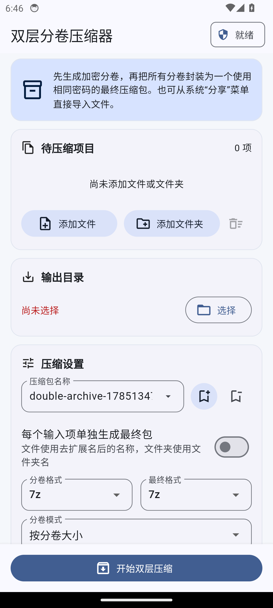

# 双层分卷压缩器

Windows 11 与 Android 双平台的双层加密分卷压缩工具。导入文件或文件夹后，程序先生成加密分卷，再使用同一密码把全部分卷封装为一个最终压缩包。



## 功能

- 第一层与第二层分别选择 `7z` 或 `zip`，两层使用统一密码。
- 两种分卷模式：
  - **按分卷大小**：自选 MB/GB。
  - **固定分卷数量**：先生成完整内层包，再按实际字节数均分，严格得到指定数量的非空分卷。
- 密码始终可见；名称预设与密码预设使用两个独立下拉框，可分别保存、选择和删除。
- 配置在重启后恢复，但待压缩文件/文件夹列表不会持久化。
- 可让每个输入项单独生成最终包；文件使用去扩展名后的名称，文件夹使用文件夹名。
- 可选覆盖同名包、保留第一层分卷、7z 文件名加密和压缩等级。
- Windows 支持拖放、文件/文件夹选择、7-Zip/Bandizip。
- Android 支持系统文件选择器、目录选择器以及“分享给双层分卷压缩器”。

## Windows 11

### 普通启动

1. 安装 [Bandizip](https://www.bandisoft.com/bandizip/) 或 [7-Zip](https://www.7-zip.org/)。
2. 从 Releases 下载 `DualVolumeCompressor-Windows-x64-*.zip` 并完整解压。
3. 运行 `Start-Compressor.bat`。
4. 拖入文件或文件夹并配置压缩参数。

也可以把 `bz.exe`、`Bandizip.exe` 或 `7z.exe` 放入项目根目录的 `tools` 文件夹。

### Windows 11 一级右键菜单

1. 完整解压 Windows 发布包，不要只从 ZIP 内直接运行。
2. 双击 `Install-Windows11-ContextMenu.bat`，接受管理员权限提示。
3. 在 Windows 11 资源管理器中右键一个或多个文件/文件夹。
4. 直接点击一级菜单中的 **“用双层分卷压缩器打开”**；程序会自动导入全部选中项目。

扩展采用原生 `IExplorerCommand` 和带外部位置的稀疏 MSIX 身份，因此出现在新版一级菜单，而不是旧版“显示更多选项”。发布包使用项目自签名证书，安装脚本会导入随包公钥并注册扩展。卸载时运行 `Remove-Windows11-ContextMenu.bat`。

相关实现：[`windows/context-menu`](windows/context-menu)、[`windows/package/AppxManifest.xml`](windows/package/AppxManifest.xml)。微软说明可参阅 [File Explorer context menus and share dialogs](https://learn.microsoft.com/windows/apps/desktop/modernize/integrate-packaged-app-with-file-explorer) 与 [Grant package identity by packaging with external location](https://learn.microsoft.com/windows/apps/desktop/modernize/grant-identity-to-nonpackaged-apps)。

## Android

1. 从 Releases 下载 `DualVolumeCompressor-Android-arm64-*.apk`。
2. 在系统提示时允许当前文件管理器安装应用。
3. 添加文件/文件夹并选择输出目录。
4. 设置格式、分卷模式、统一密码后开始压缩。

最低系统版本为 Android 7.0（API 24）。APK 内置由官方 7-Zip 26.02 源码构建的 ARM64 原生内核，不依赖手机额外安装压缩软件。密码预设使用 Android 加密存储；普通设置使用应用首选项；输入列表只存在于当前运行会话。

Android 文件夹和输出目录通过系统 Storage Access Framework 授权。应用也声明了 `ACTION_SEND` / `ACTION_SEND_MULTIPLE`，可从文件管理器的“分享”菜单导入一个或多个文件。

## 解压

1. 使用统一密码解压最终包，得到第一层分卷。
2. 使用 7-Zip/Bandizip 打开首个分卷（通常为 `.001`）并再次输入同一密码。
3. 固定数量模式的分卷是对完整内层包的顺序等分；支持数字分卷的解压器会按 `.001`、`.002`……自动组合。也可以按名称顺序二进制拼接后再打开。

## 从源码构建

### Windows

需要 Windows 11、Windows SDK、PowerShell 5.1+ 与提供 `clang++.exe`/`windres.exe` 的 LLVM-MinGW：

```powershell
powershell -ExecutionPolicy Bypass -File .\windows\build-windows.ps1
```

构建脚本会编译 x64 COM DLL 与启动器、创建稀疏 MSIX，并使用当前用户证书库中的项目代码签名证书签名。

### Android

需要 Flutter 3.24+、JDK 17、Android SDK 与 NDK 28.2：

```powershell
# 可选：从固定上游提交重建 arm64-v8a 与 x86_64 的 7zz
.\android-app\tool\build-7zip-android.ps1

# 创建自己的 release-keystore.jks 与 key.properties 后构建
.\android-app\build-android.ps1
```

`build-android.ps1` 会把 Pub/Gradle 缓存放到纯 ASCII 路径，以规避部分 Windows Kotlin/Flutter 工具对中文用户目录的路径兼容问题，并依次运行 analyze、test、release build 与 APK 签名验证。

## 发布构建

```powershell
.\build-release.ps1 -Version 1.0.0
```

产物位于 `dist/windows` 与 `dist/android`。本机配置文件 `settings.json`、Android 签名密钥和待压缩项目都不会进入 Git。

## 注意事项

- 当前创建格式为 `7z` 与 `zip`，不创建 RAR。
- ZIP 没有 7z 的完整文件名加密能力；需要隐藏文件名时，两层建议都选 7z。
- Windows 版调用命令行压缩器，密码会在本机进程参数中短暂出现。
- Windows 密码预设使用当前用户 DPAPI；Android 密码预设使用系统加密存储。
- 固定分卷数量至少为 2；完整内层包的字节数必须不小于分卷数。

## 许可

项目代码使用 [MIT License](LICENSE)。Android 内置 7-Zip 的来源、固定提交与许可见 [THIRD_PARTY_NOTICES.md](THIRD_PARTY_NOTICES.md)。发布页同时提供对应 7-Zip 源码归档。
